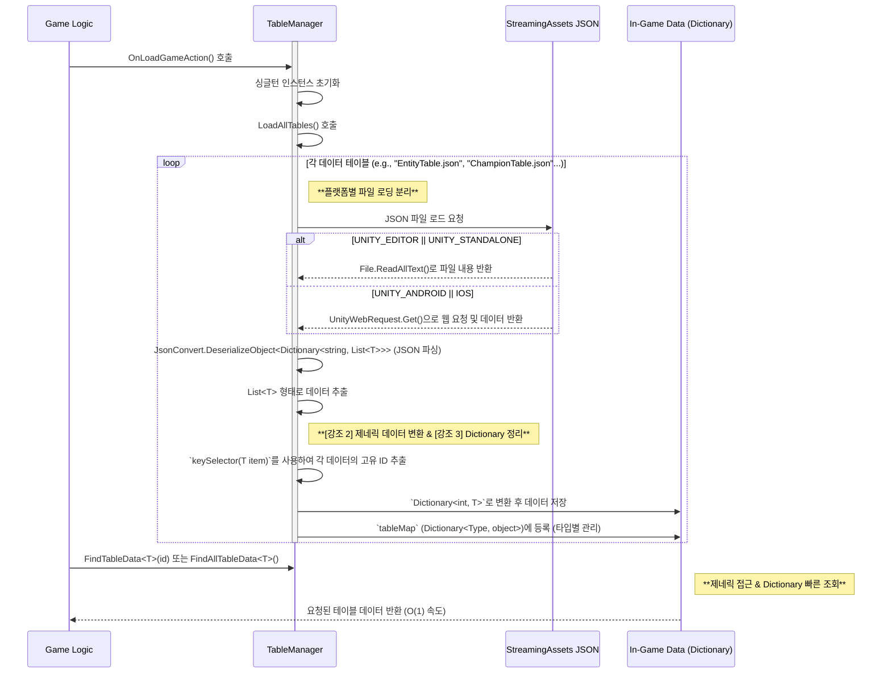
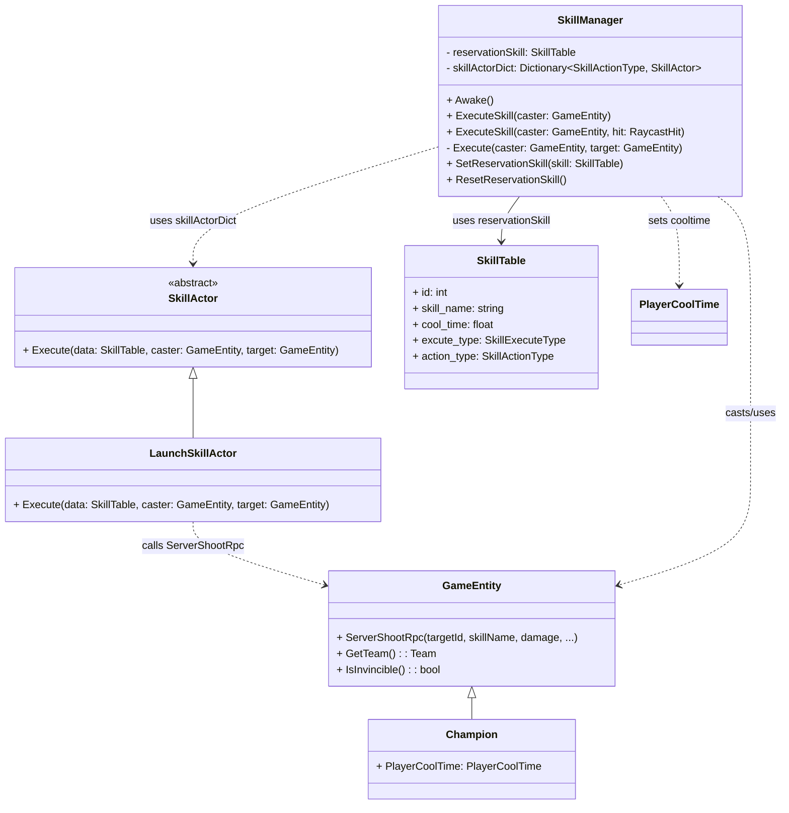

# 🐾 League of Champions : Moba

## 🎮 개요
<div align="center">
  
</div>
Moba 장르의 멀티플레이 게임입니다.

* **프로젝트 이름**: League of Champions 
* **프로젝트 지속기간**: 2025.06.13 ~ 2025.06.27
* **개발 엔진 및 기술**: Unity(Netcode for GameObjects), C#, Google spreadsheet(json Extentions)
* **팀 멤버**: 팀 "동물원" ( 김광석, 정승호, 정보연, 한태규)

---

## 📖 게임 영상
[](https://youtu.be/u795ksiAFGA)

---

## 🕹️ 프로젝트 구현

### Google Spreadsheet 기반 데이터 관리 시스템
게임의 모든 데이터를 Google Spreadsheet에서 중앙 집중식으로 관리하고, 이를 JSON 형태로 추출하여 게임 런타임에 효율적으로 불러와 사용하는 시스템입니다.
- 구글 스프레드 시트에서 Export Json 확장 툴로 json 파일로 변환
- StreamingAsset 폴더에 json들을 각 모델에 맞게 파싱해서 데이터 화
- TableManager를 통해 데이터 접근 및 읽기 (각 시트 별로 Dictionary<key, data> 단위로 저장)

*StreamingAsset폴더에 저장한 이유는 json을 원시 파일로 관리하기 위해서이다.



#### TableManager.cs 
<details>
<summary>TableManager.cs 코드 일부 보기</summary>
  
```csharp
public class TableManager : MonoBehaviour
{
    public static TableManager Instance { get; private set; }

    private Dictionary<Type, object> tableMap = new(); //테이블 제너럴 관리 위한 맵핑 구조

    private void Awake()
    {
        if (Instance == null)
        {
            Instance = this;
            DontDestroyOnLoad(gameObject);
            LoadAllTables();
        }
    }

    private void LoadAllTables()
    {
        LoadTable<EntityData>("EntityTable", out dict, model => model.id); //모델의 첫번째 아이디를 키값으로 상정하고 작업
        // ...
    }

    private void LoadTable<T>(string tableName, out Dictionary<int, T> outDict, System.Func<T, int> keySelector) where T : ITableData
    {
        //Streaming Aset으로 부터 json 데이터 가져와서 시트 단위로 Dictionary에 저장

    }

    //개별 콘크리트 데이터 테이블
    private Dictionary<int, EntityTable> entityTable = new Dictionary<int, EntityTable>();
}
```

</details>
📎 [전체 TableManager.cs 보기](https://github.com/Kyuarez/team3Moba/blob/main/Team3_Moba/Assets/Scripts/Data/TableManager/TableManager.cs)

---


### Skill System
스킬 시스템은 데이터 기반으로 정의된 스킬을 플레이어 입력에 따라 실행하고, 다양한 스킬 액션 타입(Launch, Buff 등)을 유연하게 처리하는 구조입니다.
개별 스킬 Act하는 부분을 전략 패턴(특정 작업을 클래스 화해서 런타임에 변환)적으로 구현했습니다.



#### SkillManager.cs 
<details>
<summary>SkillManager.cs 코드 일부 보기</summary>
```csharp
public class SkillManager : MonoSingleton<SkillManager>
{
    private SkillTable reservationSkill;
    private Dictionary<SkillActionType, SkillActor> skillActorDict = new Dictionary<SkillActionType, SkillActor>();

    //즉시 공격
    public bool ExecuteSkill(GameEntity caster) 
    {
        //스킬 예약 초기화 및 챔피언 처리
        return Execute(caster);
    }
    //좌표, 타겟
    public bool ExecuteSkill(GameEntity caster, RaycastHit hit)
    {
        //타겟 설정 및 Excute
        return Execute(caster, target);
    }

    private bool Execute(GameEntity caster, GameEntity target = null)
    {
        if(skillActorDict.TryGetValue(reservationSkill.action_type, out var skillActor))
        {
            skill.Actor.Excute();
            return true;
        }

        return false;
    }

    public void SetReservationSkill(SkillTable skill)
    {
        //스킬 예약
    }
    public void ResetReservationSkill()
    {
        //스킬 리셋
    }
}
```
</details>
📎 [전체 SkillManager.cs 보기](https://github.com/Kyuarez/team3Moba/blob/main/Team3_Moba/Assets/Scripts/Skill/SkillManager.cs)


#### SkillActor.cs 
<details>
<summary>SkillExcutor.cs 코드 일부 보기</summary>
```csharp
public abstract class SkillActor
{
    public abstract void Execute(SkillTable data, GameEntity caster, GameEntity target = null);
}

public class LaunchSkillActor : SkillActor
{
    public override void Execute(SkillTable data, GameEntity caster, GameEntity target = null)
    {        
        //구제적 코드
    }
}

```
</details>
📎 [전체 SkillExcutor.cs 전 보기](https://github.com/Kyuarez/team3Moba/blob/main/Team3_Moba/Assets/Scripts/Skill/SkillExecutor.cs)


