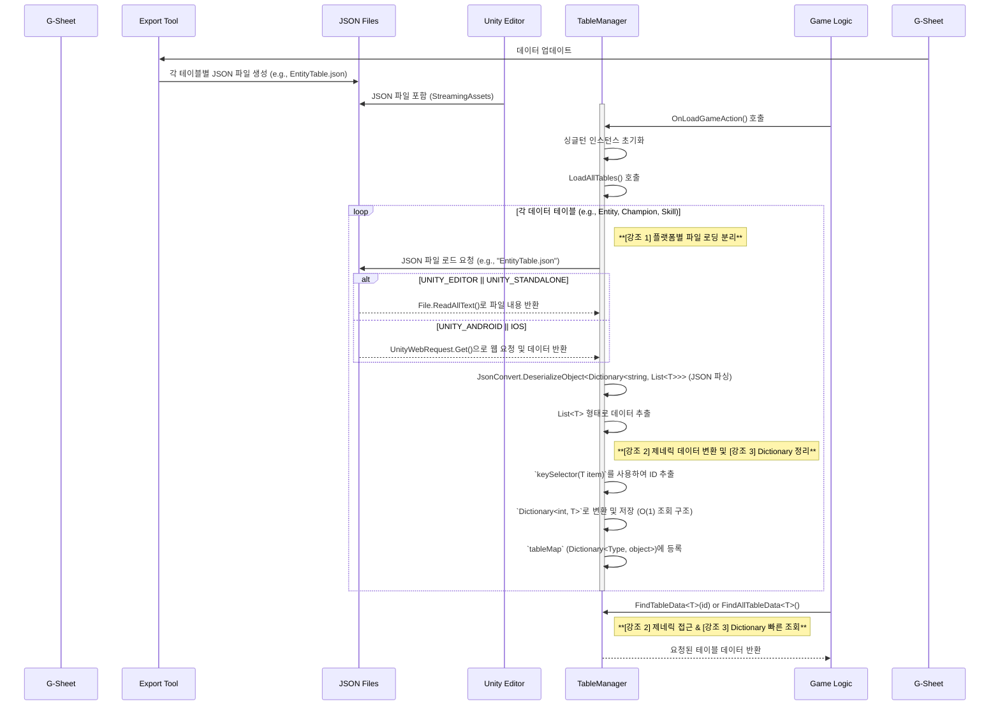

# 🐾 League of Champions : Moba

## 🎮 개요

  

Moba 장르의 멀티플레이 게임입니다.

* **프로젝트 이름**: League of Champions 
* **프로젝트 지속기간**: 2025.06.13 ~ 2025.06.27
* **개발 엔진 및 기술**: Unity(Netcode for GameObjects), C#, Google spreadsheet(json Extentions)
* **팀 멤버**: 팀 "동물원" ( 김광석, 정승호, 정보연, 한태규)

---

## 📖 게임 영상

---

## 🕹️ 프로젝트 구현

### Google Spreadsheet 기반 데이터 관리 시스템
게임의 모든 데이터를 Google Spreadsheet에서 중앙 집중식으로 관리하고, 이를 JSON 형태로 추출하여 게임 런타임에 효율적으로 불러와 사용하는 시스템입니다.
- 구글 스프레드 시트에서 Export Json 확장 툴로 json 파일로 변환
- StreamingAsset 폴더에 json들을 각 모델에 맞게 파싱해서 데이터 화
- TableManager를 통해 데이터 접근 및 읽기

### Google Fit API & Android Native Code(Java)

### AR Foundation

